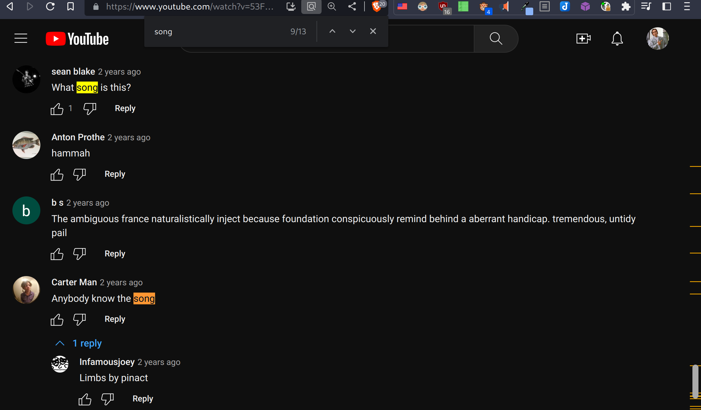
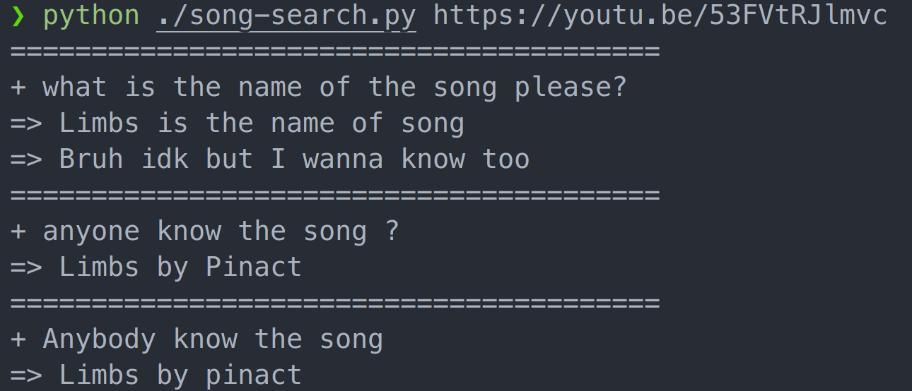

# yt-song-search

CLI tool to search the comments of a YouTube video for 'songs?*', saving you the time of scrolling through slow loading pages while spamming Ctrl+F.

| Manual | Script |
| ------ | ------ |
|  |  |

## Installation

You will need to generate a YouTube Data v3 API key in the [Google Developers Console](https://console.developers.google.com/). You can follow [this guide](https://developers.google.com/youtube/v3/getting-started) to do so.

Once you have your API key, you can add it to your environment variables as `YT_API_KEY` or modify the `self.API_key` in `SongSearch` to your API key.

